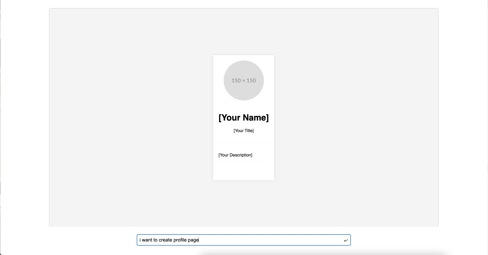

# Smart HTML Generator API

## Introduction
Welcome to the Smart HTML Generator API! This tool is designed to help you effortlessly create web pages based on specific requirements.

## Installation
Please use Python >= 3.11 && Node >= 18

```bash
git clone git@github.com:dyzsasd/SmartHtml.git
cd SmartHtml
npm run install-all
```

If your version changes, or maybe it's your first time starting a project.

```bash
bin/migrate.sh
```

At the end, you need to configure the env file.

```bash
# openai_key is a required field
cp .env.tempalte .env
```

## Startup
```bash
npm run dev
```

## Production
```bash
docker-compose up -d
```

Then we can open http://localhost:5173/

First time entering the page:


After entering prompt, the request is being sent:


After the request responds (this may take some time):



In the current version, if you need to request again, simply re-enter prompt and press enter

** If you want to wrap : press shift+enter

## API Reference
API reference can be found in swagger.yaml
